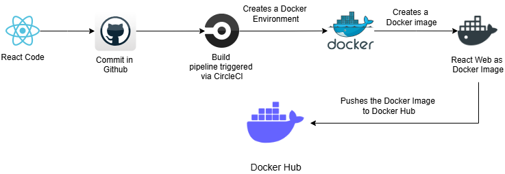
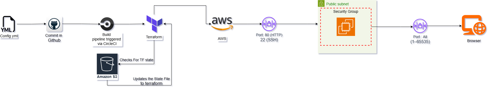

# 🚀  Website-deployment-in-AWS

This project demonstrates how to deploy a static website (such as a React app) on an AWS EC2 instance using Terraform for infrastructure provisioning. It includes modular Terraform code and follows best practices for IaC (Infrastructure as Code), state management, and secure networking.

# 📦 Features
 - 🚀 Deploy a static website to AWS EC2

- ☁️ Infrastructure provisioned using Terraform

- 🔐 AWS Security Group to allow HTTP and SSH access

- 🛠️ Modular Terraform setup for clean project structure

- 🌍 Public IP access to the deployed site

# 🛠️ Tech Stack

| *Category*            | *Technology / Tool*                                                                 | *Description*                                                                 |
|----------------------|--------------------------------------------------------------------------------------|--------------------------------------------------------------------------------|
| *Infrastructure*      | [Terraform](https://developer.hashicorp.com/terraform)                              | Infrastructure as Code (IaC) to provision AWS resources                        |
| *Cloud Provider*      | [AWS EC2](https://aws.amazon.com/ec2/)                                              | Virtual server to host the static website                                     |
| *State Management*    | [AWS S3](https://aws.amazon.com/s3/)                                                | Stores the remote Terraform state file                                        |
| *Networking*          | [AWS Security Groups](https://docs.aws.amazon.com/vpc/latest/userguide/VPC_SecurityGroups.html) | Controls inbound and outbound traffic to the EC2 instance                    |
| *Operating System*    | Amazon Linux 2 / Ubuntu                                                             | Lightweight and commonly used OS for web server hosting                       |
| *Version Control*     | Git + GitHub                                                                        | Source code management and versioning                                         |
| *Frontend*            | React (or static HTML/CSS/JS)                                                       | Static web application hosted on EC2                                          |

# 🤖 React Docker Automation

# 🤖 AWS Automation

